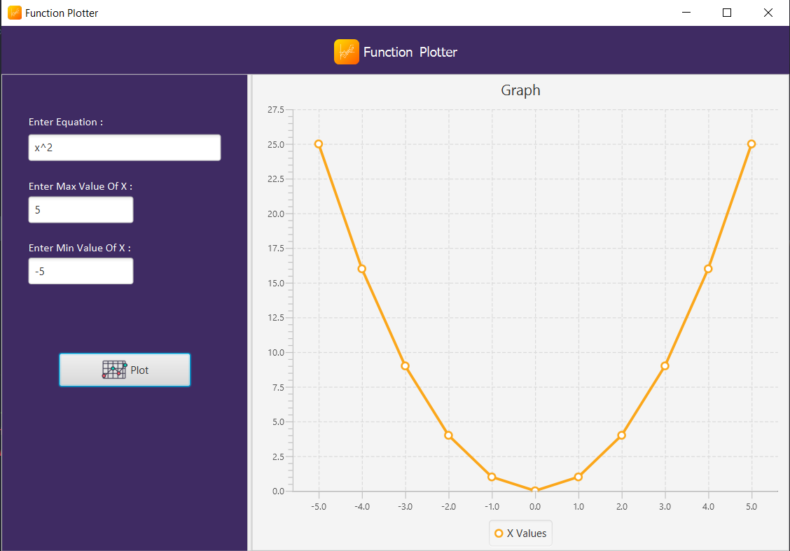

<!-- PROJECT LOGO -->
 
<align="center">
  <h1 align="center"> Function Plotter </h1>
  

<!-- ABOUT THE PROJECT -->
## About The Project

Function Plotter Is JavaFx GUI Desktop Application Used To Plot Graphs Using Mathimatical Equation (in terms of 'x') And The Min And Max Value Of X 

Matimatical Equation Types:
* basic operators
* math functions (large library of  unary, binary, 3-args, and n-args functions) i.e.: sin, cos, Stirling numbers, log, inverse functions
* constants (large library), i.e.: pi, e, golden ratio

### Built With

This App Build With

* [Java](https://www.java.com/en/)
* [JavaFX](https://openjfx.io/)
* [FXML](https://docs.oracle.com/javafx/2/get_started/fxml_tutorial.htm)
* [XmathParser](http://mathparser.org/)

<!-- USAGE EXAMPLES -->
## Usage

* Run The Project In Intlij
* Enter The Equation In Terms Of x (ex: x^2)
* Enter The Minimum Value Of x (ex: 2)
* Enter The Maximum Value Of x (ex: 5)
* Press Plot

<!-- CONTACT -->
## Contact

linkedin - [Ahmedbadr](https://www.linkedin.com/in/ahmed-badr-25953a19a/)

